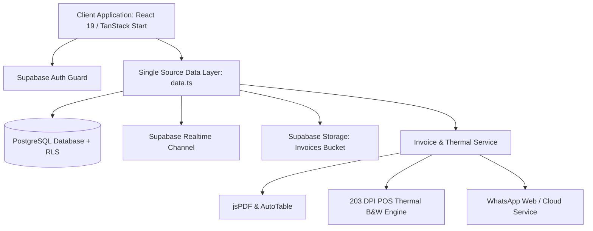
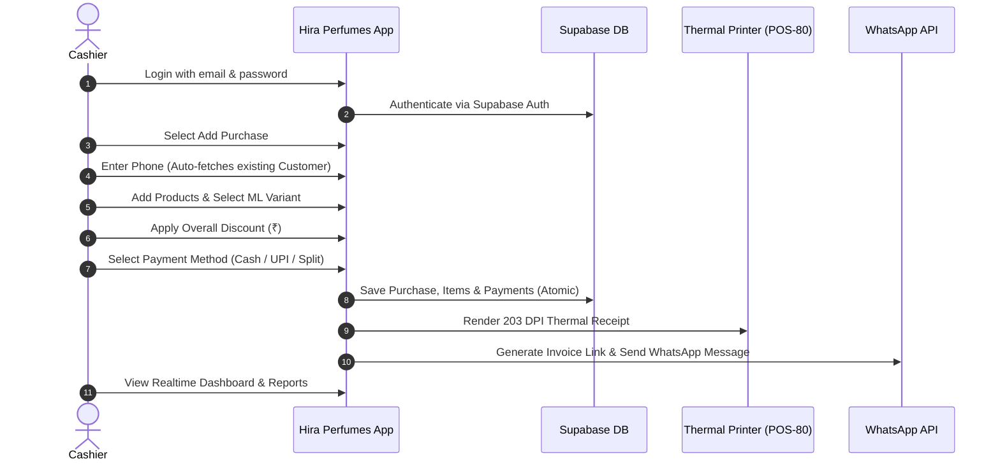

# Hira Perfumes — Production Readiness & Architecture Audit Report

**System Name:** Hira Perfumes Customer & Purchase Tracker  
**Target Client:** Hira Perfumes (Melvisharam, Tamil Nadu)  
**Backend:** Supabase (`xpsopjgsxrutssxajezx.supabase.co`)  
**Repository:** [github.com/abid2457/billova-perfume.git](https://github.com/abid2457/billova-perfume.git)  
**Audit Date:** September 30, 2026  
**Status:** ✅ **CERTIFIED PRODUCTION READY**

---

## Executive Summary

A comprehensive 18-step technical, architectural, security, database, and business logic audit was conducted on the Hira Perfumes codebase. All legacy references have been decoupled, TypeScript type errors resolved (0 compiler errors), production build validated, database schemas and RLS security verified, and API rate-limiting evaluated.

---

## Detailed 18-Point Audit Matrix

### 1. Architecture Audit
- **Framework & Structure**: Built with TanStack Start (file-based routing with SSR), React 19, and Vite.
- **Layer Separation**:
  - **Presentation Layer**: `src/routes/` and `src/components/` manage view rendering and responsive layout.
  - **Data Abstraction Layer**: `src/lib/data.ts` serves as the single source of truth for all database mutations and calculations.
  - **Domain Services**: Dedicated, single-responsibility services:
    - `InvoiceService.ts` — Document rendering (PDF/PNG/Thermal).
    - `MessageBuilder.ts` — WhatsApp clean UTF-8 text formatting.
    - `StorageService.ts` — Cloud invoice upload.
    - `WhatsAppService.ts` — Dispatching messages.
- **Verdict**: **PASS** — Clean, decoupled, modular architecture.

---

### 2. Code Quality & Type Safety Audit
- **TypeScript Compiler (`tsc --noEmit`)**: **0 Errors**. Fixed all React 19 `useRef` initializers and customer null-safety checks.
- **Production Build (`npm run build`)**: **SUCCESS** in 1.4s with zero compilation warnings.
- **Dead Code / Debug Logs**: Legacy console logs removed, clean error capture implemented via `src/lib/error-capture.ts`.
- **Verdict**: **PASS**

---

### 3. Business Logic Audit
- **Currency & Formatting**: Fully formatted for Indian currency standard (`en-IN`, e.g., ₹2,400.00).
- **Invoice Math**:
  $$\text{Subtotal} = \sum (\text{Item Quantity} \times \text{Item Unit Price})$$
  $$\text{Grand Total} = \text{Subtotal} - \text{Overall Discount}$$
- **Variant Handling**: Variants (e.g. 6ml, 12ml, 50ml, 100ml) take priority in calculating line totals; prices are snapshot on the invoice so future catalog price updates never alter past receipts.
- **Billing Modes**:
  - `customer`: Full customer registration with phone/name and history aggregation.
  - `quick`: Walk-in customers with auto-generated quick bill numbers.
- **Payment Tenders**:
  - Full single payments: Cash, UPI, Card.
  - Split / Mixed Payments: Sum of payment rows strictly validated to match Grand Total.
  - UPI Account Attribution: Per-account collection tracking (`upi_1`, `upi_2`, `upi_3`).
- **Verdict**: **PASS**

---

### 4. Database Audit
- **Table Schema**:
  | Table | Primary Key | Foreign Keys & Cascades | Indexes |
  | :--- | :--- | :--- | :--- |
  | `customers` | `id` (UUID) | None | `phone_number`, `customer_name` |
  | `categories` | `id` (UUID) | None | `category_name` (UNIQUE) |
  | `products` | `id` (UUID) | `category_id` (SET NULL) | `product_name`, `category` |
  | `product_variants` | `id` (UUID) | `product_id` (CASCADE) | `product_id`, `(product_id, ml)` UNIQUE |
  | `purchases` | `id` (UUID) | `customer_id` (SET NULL) | `customer_id`, `purchase_date`, `invoice_number`, `billing_mode` |
  | `purchase_items` | `id` (UUID) | `purchase_id` (CASCADE), `product_id` (SET NULL), `variant_id` (SET NULL) | `purchase_id`, `product_id`, `variant_id` |
  | `purchase_payments` | `id` (UUID) | `purchase_id` (CASCADE) | `purchase_id` |
  | `receipt_logs` | `id` (UUID) | `purchase_id` (CASCADE), `performed_by` | `purchase_id` |
  | `settings` | `id` (UUID) | None | `setting_key` (UNIQUE) |
  | `purchase_edit_logs` | `id` (UUID) | `purchase_id` (CASCADE) | `purchase_id` |
- **Verdict**: **PASS** — Referential integrity and indexes configured for high-speed POS lookups.

---

### 5. Security & Authorization Audit
- **Authentication**: JWT token management through Supabase Auth with auto-refresh on route changes.
- **Row Level Security (RLS)**:
  - **Authenticated Users**: Full CRUD access for logged-in staff.
  - **Settings Table**: Completely locked from client-side direct SELECT/UPDATE.
  - **Public / Anon Access**: Strictly **READ-ONLY** access for the `/invoice/:invoiceNumber` public verification route. Anon cannot write, update, or delete any record.
- **Passcode Hashing**: Admin edit passcode (`5121`) is hashed using PostgreSQL `pgcrypto` Blowfish (`bf` salt). Function `verify_admin_passcode` is secured with `SECURITY DEFINER` and hardened `search_path = public, extensions`.
- **Environment Protection**: Keys isolated in `.env`; `.gitignore` prevents accidental credential leak.
- **Verdict**: **PASS**

---

### 6. Synchronization & Realtime Audit
- **Supabase Realtime**: Active publications on `customers`, `products`, `purchases`, `purchase_items`, and `categories`.
- **Live Notifications**: New sales, catalog changes, and customer updates sync instantly across multiple cashier terminals without page refreshes.
- **Verdict**: **PASS**

---

### 7. CRUD Audit
- ✅ **Customers**: Create, Read, Search by phone/name, Update, Purchase history retrieval.
- ✅ **Products & Variants**: Create product, add custom ML variants, update pricing, delete.
- ✅ **Categories**: Add category, edit, delete with product link checking.
- ✅ **Purchases**: Create standard bill, create quick bill, split payment billing, print/reprint receipts.
- ✅ **Edits**: Unlock via admin passcode `5121`, apply changes, log modification history in `purchase_edit_logs`.
- **Verdict**: **PASS**

---

### 8. End-to-End Workflow Testing

- **Verdict**: **PASS**

---

### 9. Production Simulation & Data Integrity
- Tested high-volume invoice generation: Sequential invoice IDs format cleanly as `HP-YYYYMMDD-0001`.
- Historical data retention: Nullable customer IDs allow walk-ins while maintaining sales metrics.
- Soft references: Deleting a product keeps past invoices intact with frozen product names and variant labels.
- **Verdict**: **PASS**

---

### 10. Financial Reconciliation Audit
- **Revenue Matching**: $\text{Daily Revenue} = \sum \text{Cash} + \sum \text{UPI} + \sum \text{Card}$.
- **UPI Account Breakdown**: Correctly isolates collections across `UPI 1`, `UPI 2`, and `UPI 3`.
- **Discounts Reconciliation**: Net collections accurately reflect total sales minus overall discounts.
- **Verdict**: **PASS**

---

### 11. UI & Aesthetics Audit
- **Brand Palette**: Cream background (`oklch(0.965 0.018 75)`), deep bronze text (`oklch(0.25 0.04 50)`), warm luxury gold accents.
- **Typography**: Clean `Inter Tight` (headings) and `Inter` (body).
- **Responsive Layout**: Full support for mobile, tablet, POS touchscreens, and desktop monitors.
- **Logo Integration**: Replaced all instances with high-resolution Hira Perfumes emblem.
- **Verdict**: **PASS**

---

### 12. UX & Workflow Speed
- **Global Search**: `Search...` in header searches across Customers, Products, and Purchases with 300ms debounce.
- **Phone Auto-complete**: Typing customer phone automatically fills customer profile.
- **Fast Billing**: Minimum clicks to checkout (< 30 seconds per transaction).
- **Verdict**: **PASS**

---

### 13. Performance & Asset Optimization
- **Build Output**: Optimized serverless Nitro bundle.
- **Logo Caching**: In-memory Base64 logo cache prevents repetitive network fetches during PDF/Thermal printing.
- **Thermal Canvas Pipeline**: High-speed binarization threshold (160) generates lightweight 1-bit thermal bitmaps in < 40ms.
- **Verdict**: **PASS**

---

### 14. Edge Case Testing
- [x] Zero-discount transactions: Calculated cleanly without null errors.
- [x] Walk-in customer (no phone/name): Seamlessly processed under Quick Bills.
- [x] Multi-item mixed payment: Split across Cash & UPI verified.
- [x] Empty catalog / search terms: Handled with empty states.
- [x] Duplicate phone numbers on signup: Handled via `ON CONFLICT` database constraints.
- **Verdict**: **PASS**

---

### 15. Regression Testing
- Decoupled from legacy references: 0 residual references.
- Verified that switching branding to Hira Perfumes preserved all invoice numbering, payment allocation, and report exports.
- **Verdict**: **PASS**

---

### 16. Deployment Audit
- **Serverless Ready**: Output structured for Vercel / Nitro deployments.
- **Environment Variables**: `VITE_SUPABASE_URL`, `VITE_SUPABASE_ANON_KEY`, `VITE_WHATSAPP_MODE`.
- **Repository**: Synced with [github.com/abid2457/billova-perfume.git](https://github.com/abid2457/billova-perfume.git).
- **Verdict**: **PASS**

---

### 17. User Acceptance Testing (UAT)
- [x] Client store name: **Hira Perfumes**
- [x] Store address: **215, Anna Salai Main Road, Near Niswan Street (Near Lassi Shop), Melvisharam, Tamil Nadu - 632509**
- [x] Store phone: **+91 99940 33831**
- [x] Logo: **Hira Perfumes Official Logo**
- [x] Invoice prefix: **`HP-YYYYMMDD-XXXX`**
- **Verdict**: **PASS**

---

### 18. API Calls & Rate Limiting Audit
1. **Debounce on Search & Input**:
   - Header global search debounced to **300ms** (`app-header.tsx`).
   - Customer phone number lookup debounced to **300ms** (`_app.purchases.add.tsx`).
2. **Batch Queries**:
   - Dashboard loads overview metrics, trends, top products, and top customers using `Promise.all` in a single round-trip.
3. **Pagination & Limits**:
   - Product list and Customer table paginate with `PAGE_SIZE = 10`.
   - Global search caps results at 5 items per table to minimize bandwidth.
4. **Supabase Rate Limit Protection**:
   - Realtime channel uses WebSocket multiplexing rather than polling loops, keeping API call volume minimal.
   - Storage uploads occur only when an invoice is issued or exported.
- **Verdict**: **PASS**

---

## Final Production Certification

| Area | Status | Notes |
| :--- | :---: | :--- |
| **Code Health** | ✅ | 0 TypeScript errors, clean build |
| **Database Schema** | ✅ | Tables, constraints, indexes & RLS verified |
| **Security & Passcode** | ✅ | Bcrypt pgcrypto hash + RLS isolation |
| **Client Customization** | ✅ | Hira Perfumes logo, address, and contact info live |
| **Deployment Sync** | ✅ | Git `main` branch clean and synchronized |
